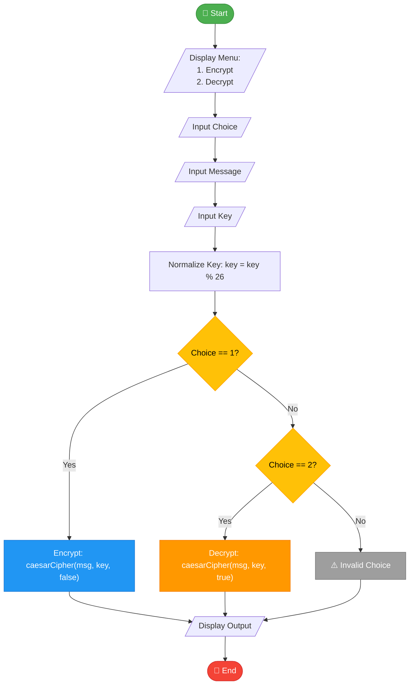

<div align="center">

# 🔐 Caesar Cipher — Information Security Assignment

[](cpp/caesar_cipher.cpp)
[](python/caesar-cipher.py)
[]()

A clean, well-documented implementation of the **Caesar Cipher** encryption algorithm in both **C++** and **Python**, created as part of the Information Security course assignments.

</div>

---

## 📖 Table of Contents

- [Overview](#-overview)
- [How It Works](#-how-it-works)
- [Program Flowchart](#-program-flowchart)
- [Project Structure](#-project-structure)
- [Getting Started](#-getting-started)
- [Usage Examples](#-usage-examples)
- [Algorithm Details](#-algorithm-details)
- [Contributing](#-contributing)

---

## 🧠 Overview

The **Caesar Cipher** is one of the earliest and simplest encryption techniques in cryptography. It is a **substitution cipher** where each letter in the plaintext is shifted by a fixed number of positions down or up the alphabet.

This project provides:

- **Encryption** — convert plaintext into ciphertext using a secret key.
- **Decryption** — recover the original plaintext from ciphertext using the same key.
- Implementations in both **C++** and **Python** for cross-language reference.

---

## ⚙️ How It Works

| Step | Description |
|------|-------------|
| 1 | The user selects **Encrypt** or **Decrypt** mode. |
| 2 | The user enters the **message** (plaintext or ciphertext). |
| 3 | The user provides a **key** (shift value between 1–25). |
| 4 | The key is **normalized** using `key = key % 26` to ensure it stays within bounds. |
| 5 | Each alphabetic character is shifted by the key value; non-alphabetic characters remain unchanged. |
| 6 | The **result** (encrypted or decrypted message) is displayed. |

---

## 📊 Program Flowchart



---

## 📁 Project Structure

```
Information_Security-_Assignments-/
├── cpp/
│   └── caesar_cipher.cpp          # C++ implementation
├── python/
│   └── caesar-cipher.py           # Python implementation
├── diagram.png                    # Flowchart diagram image
├── assignment1_information_security.docx
└── README.md                      # This file
```

---

## 🚀 Getting Started

### Prerequisites

| Language | Requirement |
|----------|-------------|
| C++      | A C++ compiler (g++, clang++, or MSVC) |
| Python   | Python 3.6 or higher |

### Running the C++ Version

```bash
# Navigate to the C++ directory
cd cpp

# Compile the program
g++ -o caesar_cipher caesar_cipher.cpp

# Run the program
./caesar_cipher
```

### Running the Python Version

```bash
# Navigate to the Python directory
cd python

# Run the program
python caesar-cipher.py
```

---

## 💡 Usage Examples

### Encryption

```
=== Caesar Cipher Program ===
1. Encrypt
2. Decrypt
Enter your choice (1 or 2): 1
Enter the message: Hello World
Enter the key (shift number 1-25): 3

Encrypted Message:
Khoor Zruog
```

### Decryption

```
=== Caesar Cipher Program ===
1. Encrypt
2. Decrypt
Enter your choice (1 or 2): 2
Enter the message: Khoor Zruog
Enter the key (shift number 1-25): 3

Decrypted Message:
Hello World
```

---

## 🔬 Algorithm Details

The core encryption formula for each character is:

```
Encrypted = (character_position + key) mod 26
Decrypted = (character_position - key) mod 26
```

### Key Characteristics

| Property | Detail |
|----------|--------|
| **Type** | Symmetric substitution cipher |
| **Key Space** | 25 possible keys (1–25) |
| **Case Handling** | Preserves original letter casing |
| **Non-Alpha Characters** | Spaces, digits, and symbols are left unchanged |
| **Key Normalization** | Keys outside 0–25 are wrapped using modulo 26 |

### Core Function Signatures

**C++**
```cpp
char shiftChar(char c, int key);
string caesarCipher(string text, int key, bool decrypt = false);
```

**Python**
```python
def shift_char(c: str, key: int) -> str
def caesar_cipher(text: str, key: int, decrypt: bool = False) -> str
```

---

## 🤝 Contributing

This is an academic assignment repository. However, suggestions and improvements are welcome:

1. **Fork** the repository
2. **Create** a feature branch (`git checkout -b feature/improvement`)
3. **Commit** your changes (`git commit -m 'Add improvement'`)
4. **Push** to the branch (`git push origin feature/improvement`)
5. **Open** a Pull Request

---

<div align="center">

**Made with ❤️ for Information Security Course**

*Caesar Cipher — The foundation of modern cryptography*

</div>
